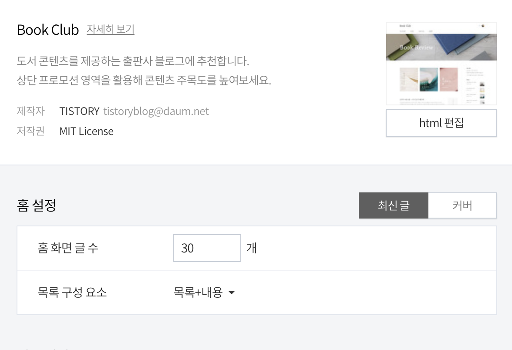
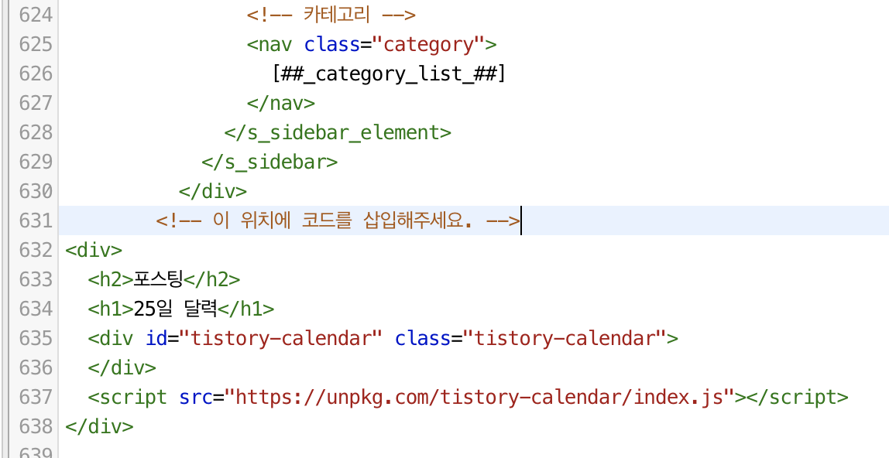

# 티스토리용 포스트 캘린더 위젯
  
> Github 스타일의 캘린더 위젯을 티스토리에서 사용해보세요

Github의 stat 캘린더는 개발 욕구를 증진시켜주는 역할도 하며, 지난 과거를 돌아볼 수도 있습니다. 

이제 티스토리 위젯으로 포스팅 캘린더를 만나보세요 😃


[예시 페이지](dev-pengun.tistory.com)

# :zap: 적용방법

> 현재 Book Club 스킨에서만 적용 가능합니다.


1. 스킨 편집 메뉴 > 홈 설정 > 홈 화면 글 수 30으로 설정



2. 스킨 편집 메뉴 > html 편집 > 원하는 위치에 코드 삽입

> 카테고리와 공지사항 중간의 위치는 약 630번째 줄에 삽입
```
<div>
  <h2>포스팅</h2>
  <h1>25일 달력</h1>
  <div id="tistory-calendar" class="tistory-calendar">
  </div>
  <script src="https://unpkg.com/tistory-calendar/index.js"></script>
</div>		
```

# :interrobang: 컨트리뷰트 또는 버그제보

[Github Issue](https://github.com/ICEB3AR/tistory-calendar/issues)로 버그, 아이디어를 제보해주세요!